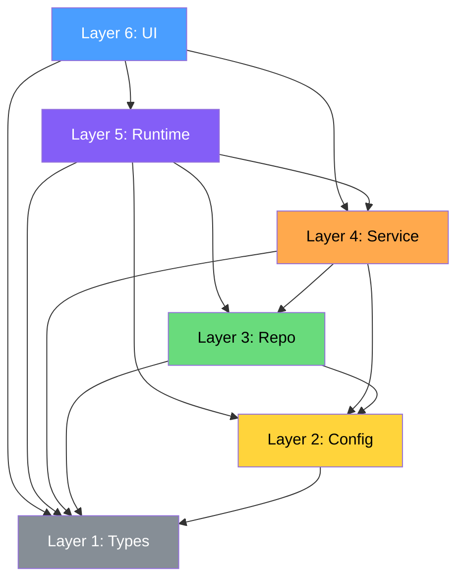

# 6-Layer Architecture Model

This document defines the fixed 6-layer architecture model used by the architecture-enforcer plugin for Harness Engineering. The model provides a universal, opinionated layer structure that eliminates ambiguity about where code belongs and how dependencies should flow.

## Layer Overview

```
Layer 6: UI          — Components, pages, CLI handlers
Layer 5: Runtime     — App bootstrap, middleware, DI container
Layer 4: Service     — Business logic, use cases, orchestration
Layer 3: Repo        — Data access, external API clients, DB queries
Layer 2: Config      — Configuration loading, env vars, feature flags
Layer 1: Types       — Pure type definitions, interfaces, enums
```

**Core rule**: Dependencies flow **downward only**. A layer may import from any layer with a lower number, but never from a layer with a higher number.



## Layer Definitions

### Layer 1: Types

**Purpose**: Pure type definitions. The foundation of the entire system.

**Contains**:
- TypeScript `type` and `interface` declarations
- Enums and const enums
- Zod schemas (type-level only, no runtime validation logic)
- Generic utility types
- Domain value object types

**Rules**:
- No runtime code (no functions, no classes with methods)
- No imports from any other layer
- May import from external type packages (`@types/*`)
- Every other layer may import from Types

**Example paths**: `src/types/`, `src/interfaces/`, `src/domain/types/`

**Example files**:
```typescript
// src/types/order.ts
export interface Order {
  id: string;
  userId: string;
  items: OrderItem[];
  status: OrderStatus;
  createdAt: Date;
}

export type OrderStatus = 'pending' | 'confirmed' | 'shipped' | 'delivered';

export interface OrderItem {
  productId: string;
  quantity: number;
  unitPrice: number;
}
```

---

### Layer 2: Config

**Purpose**: Configuration loading and environment management.

**Contains**:
- Environment variable readers
- Configuration file parsers
- Feature flag definitions
- App-level constants derived from environment
- Configuration validation

**Rules**:
- May import from: **Types** only
- Must not contain business logic
- Configuration values should be read once and frozen
- Expose configuration through typed objects, not raw `process.env` access

**Example paths**: `src/config/`, `src/env/`, `src/settings/`

**Example files**:
```typescript
// src/config/database.ts
import type { DatabaseConfig } from '../types/config';

export function loadDatabaseConfig(): DatabaseConfig {
  return {
    host: process.env.DB_HOST ?? 'localhost',
    port: parseInt(process.env.DB_PORT ?? '5432', 10),
    name: process.env.DB_NAME ?? 'app',
    ssl: process.env.DB_SSL === 'true',
  };
}
```

---

### Layer 3: Repo (Repository / Data Access)

**Purpose**: Data access abstraction. All external I/O goes through this layer.

**Contains**:
- Database query functions (SQL, ORM calls)
- External API clients (REST, gRPC, GraphQL)
- File system access
- Cache access (Redis, Memcached)
- Message queue producers/consumers
- Third-party SDK wrappers

**Rules**:
- May import from: **Types**, **Config**
- Must not contain business logic or orchestration
- Each repository should focus on a single data source or aggregate
- Return domain types (from Layer 1), not ORM/database-specific types
- Handle data mapping internally (e.g., Prisma model -> domain type)

**Example paths**: `src/repositories/`, `src/data/`, `src/clients/`, `src/adapters/`

**Example files**:
```typescript
// src/repositories/orderRepository.ts
import type { Order, OrderStatus } from '../types/order';
import { loadDatabaseConfig } from '../config/database';

export async function findOrderById(id: string): Promise<Order | null> {
  const config = loadDatabaseConfig();
  // Database query using config...
  // Map database row to Order type and return
}

export async function updateOrderStatus(id: string, status: OrderStatus): Promise<void> {
  // Database update...
}
```

---

### Layer 4: Service

**Purpose**: Business logic and use case orchestration.

**Contains**:
- Use case implementations
- Business rule validation
- Workflow orchestration (coordinating multiple repositories)
- Transaction management
- Domain event emission
- Input validation (business rules, not HTTP parsing)

**Rules**:
- May import from: **Types**, **Config**, **Repo**
- Must not import from: **Runtime**, **UI**
- Must not access databases directly (use Repo layer)
- Must not handle HTTP requests/responses (that is UI or Runtime)
- Should be testable without any infrastructure

**Example paths**: `src/services/`, `src/usecases/`, `src/application/`

**Example files**:
```typescript
// src/services/orderService.ts
import type { Order, OrderItem } from '../types/order';
import { findOrderById, updateOrderStatus } from '../repositories/orderRepository';
import { getFeatureFlag } from '../config/features';

export async function placeOrder(userId: string, items: OrderItem[]): Promise<Order> {
  // Business validation
  if (items.length === 0) throw new Error('Order must have at least one item');

  // Check feature flags
  const maxItems = getFeatureFlag('maxOrderItems') ?? 100;
  if (items.length > maxItems) throw new Error(`Maximum ${maxItems} items per order`);

  // Orchestrate repositories
  // ...
}
```

---

### Layer 5: Runtime

**Purpose**: Application bootstrap, middleware, and dependency injection.

**Contains**:
- Application entry point (`main.ts`, `app.ts`)
- HTTP/WebSocket server setup
- Middleware chain configuration
- Dependency injection container setup
- Background job schedulers
- Health check endpoints
- Graceful shutdown handlers

**Rules**:
- May import from: **Types**, **Config**, **Repo**, **Service**
- Must not import from: **UI**
- This is where all layers are wired together
- Should configure DI bindings, not implement business logic
- Middleware should delegate to Services for logic

**Example paths**: `src/runtime/`, `src/bootstrap/`, `src/server/`, `src/app/`

**Example files**:
```typescript
// src/runtime/server.ts
import { loadDatabaseConfig } from '../config/database';
import { orderService } from '../services/orderService';
import { orderRepository } from '../repositories/orderRepository';

export function createApp() {
  const dbConfig = loadDatabaseConfig();
  // Wire up DI container
  // Configure middleware
  // Register routes (but route handlers are in UI layer)
  // Return configured app
}
```

---

### Layer 6: UI

**Purpose**: User-facing interfaces and presentation.

**Contains**:
- React/Vue/Svelte components
- Page/screen definitions
- CLI command handlers
- REST API route handlers (the handler functions, not the server setup)
- GraphQL resolvers
- WebSocket event handlers
- View models and presenters

**Rules**:
- May import from: **Types**, and may use **Services** via DI/Providers
- Should not directly import from: **Repo**, **Config**, **Runtime**
- UI components should be thin: delegate logic to Services
- Access cross-cutting concerns through Providers, not direct imports
- In strict mode, UI can only access Services through dependency injection

**Example paths**: `src/components/`, `src/pages/`, `src/views/`, `src/routes/`, `src/cli/`

**Example files**:
```typescript
// src/components/OrderList.tsx
import type { Order } from '../types/order';
import { providers } from '../providers';

export function OrderList({ orders }: { orders: Order[] }) {
  const { logger } = providers;
  logger.info('Rendering order list', { count: orders.length });

  return (
    <ul>
      {orders.map(order => (
        <li key={order.id}>{order.id} - {order.status}</li>
      ))}
    </ul>
  );
}
```

---

## Providers Pattern

Providers handle **cross-cutting concerns** that are needed across multiple layers. Instead of scattering direct imports of logging libraries, auth utilities, or telemetry SDKs throughout the codebase, all cross-cutting access goes through a single `Providers` interface.

### Why Providers?

Without Providers:
```typescript
// Scattered across 50 files:
import { logger } from '../lib/winston';
import { trackEvent } from '../lib/segment';
import { getUser } from '../lib/auth0';
import { isEnabled } from '../lib/launchdarkly';
```

With Providers:
```typescript
// Single import everywhere:
import { providers } from '../providers';

const { logger, telemetry, auth, featureFlags } = providers;
```

### Benefits

1. **Single point of configuration** — Change the logging library in one place, not 50 files
2. **Testability** — Mock all cross-cutting concerns by replacing the Providers object
3. **Consistency** — Every file accesses logging/auth/telemetry the same way
4. **Discoverability** — New developers see all available cross-cutting services in one interface

### Providers Interface

```typescript
// src/providers/index.ts
import type { Logger } from '../types/logger';
import type { Telemetry } from '../types/telemetry';
import type { Auth } from '../types/auth';
import type { FeatureFlags } from '../types/featureFlags';

export interface Providers {
  logger: Logger;
  telemetry: Telemetry;
  auth: Auth;
  featureFlags: FeatureFlags;
}

// Concrete implementation wired at Runtime (Layer 5)
export const providers: Providers = {
  logger: createWinstonLogger(),
  telemetry: createSegmentClient(),
  auth: createAuth0Client(),
  featureFlags: createLaunchDarklyClient(),
};
```

### Rules for Providers

- The `Providers` **interface** lives in Types (Layer 1)
- The `Providers` **implementation** is wired in Runtime (Layer 5)
- The `providers` **singleton** is exported from `src/providers/` and accessible from all layers
- Individual concern implementations (winston, segment, etc.) are internal to the providers module
- Code outside providers must not import implementation libraries directly

### Common Providers

| Concern | Interface | Example Implementations |
|---------|-----------|------------------------|
| Logging | `Logger` | winston, pino, console |
| Telemetry | `Telemetry` | Segment, Amplitude, PostHog |
| Auth | `Auth` | Auth0, Clerk, custom JWT |
| Feature Flags | `FeatureFlags` | LaunchDarkly, Unleash, env-based |
| Error Tracking | `ErrorTracker` | Sentry, Bugsnag, Datadog |
| Cache | `Cache` | Redis, Memcached, in-memory |

---

## Dependency Rules Summary

```
Layer          Can Import From                Cannot Import From
───────────    ────────────────────────────    ──────────────────────────
Types (1)      (nothing)                       Config, Repo, Service, Runtime, UI
Config (2)     Types                           Repo, Service, Runtime, UI
Repo (3)       Types, Config                   Service, Runtime, UI
Service (4)    Types, Config, Repo             Runtime, UI
Runtime (5)    Types, Config, Repo, Service    UI
UI (6)         Types, (Services via DI/Providers)  Config*, Repo*, Runtime*
```

*UI should access Config, Repo, and Runtime indirectly through Services or Providers.

---

## Module Boundaries

Within each layer, modules may have additional boundary rules defined in `.arch-rules.json`. These are orthogonal to the layer rules:

- A module in the Service layer can be forbidden from importing another Service module
- Shared modules (`src/types`, `src/utils`) are exempt from boundary checks by default
- Isolated modules (`isolate: true`) can only import from shared modules

---

## Anti-Patterns

### 1. Upward dependency

```typescript
// BAD: Service (L4) imports from UI (L6)
// src/services/orderService.ts
import { OrderForm } from '../components/OrderForm'; // VIOLATION

// GOOD: Use a type from Layer 1
import type { OrderFormData } from '../types/order';
```

### 2. Skipping layers (in strict mode)

```typescript
// BAD (strict mode): UI (L6) directly calls Repo (L3)
// src/pages/OrderPage.tsx
import { findOrderById } from '../repositories/orderRepository'; // VIOLATION

// GOOD: UI calls Service, Service calls Repo
import { getOrder } from '../services/orderService';
```

### 3. Direct cross-cutting imports

```typescript
// BAD: Direct import of logging library
import { createLogger } from 'winston'; // VIOLATION (providers-pattern rule)

// GOOD: Use Providers
import { providers } from '../providers';
const { logger } = providers;
```

### 4. Business logic in wrong layer

```typescript
// BAD: Business validation in Repo layer
// src/repositories/orderRepository.ts
export async function createOrder(order: Order) {
  if (order.items.length === 0) throw new Error('Empty order'); // Business logic in Repo!
  await db.insert(order);
}

// GOOD: Business logic in Service layer
// src/services/orderService.ts
export async function placeOrder(order: Order) {
  if (order.items.length === 0) throw new Error('Empty order'); // Belongs here
  await orderRepository.createOrder(order);
}
```

### 5. Configuration scattered across layers

```typescript
// BAD: Reading env vars in Service layer
// src/services/emailService.ts
const apiKey = process.env.SENDGRID_API_KEY; // VIOLATION

// GOOD: Configuration in Config layer
// src/config/email.ts
export const emailConfig = { apiKey: process.env.SENDGRID_API_KEY };

// src/services/emailService.ts
import { emailConfig } from '../config/email';
```

---

## Circular Dependencies

Circular dependencies are prohibited at all levels. When detected:

1. **Between layers**: Indicates a fundamental architecture violation. The fix is always to move code to the correct layer.
2. **Within a layer**: Extract shared code into a new module within the same layer, or push shared types down to Layer 1.
3. **Between modules**: Use dependency inversion — define an interface in the depended module, implement it in the other.

---

## Mapping to Common Frameworks

| Layer | Next.js | NestJS | Express | FastAPI |
|-------|---------|--------|---------|---------|
| Types | `types/` | `dto/`, `interfaces/` | `types/` | `schemas/` |
| Config | `config/` | `config/` | `config/` | `config/` |
| Repo | `lib/db/` | `*.repository.ts` | `models/` | `crud/`, `db/` |
| Service | `lib/actions/` | `*.service.ts` | `services/` | `services/` |
| Runtime | `instrumentation.ts` | `main.ts`, `app.module.ts` | `app.ts` | `main.py` |
| UI | `app/`, `components/` | `*.controller.ts` | `routes/` | `routers/` |

---

## Naming Conventions by Layer

| Layer | Convention | Suffix | Example |
|-------|-----------|--------|---------|
| Types | PascalCase (types), camelCase (files) | `.types.ts`, `.d.ts` | `Order`, `order.types.ts` |
| Config | camelCase | `Config` | `databaseConfig.ts` |
| Repo | camelCase | `Repository` | `orderRepository.ts` |
| Service | camelCase | `Service` | `orderService.ts` |
| Runtime | camelCase | — | `server.ts`, `bootstrap.ts` |
| UI | PascalCase (components) | `.tsx`, `.vue` | `OrderList.tsx` |
